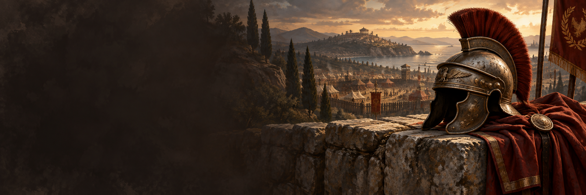

<p align="center">
  
</p>
<h1 align="center">Syncrash</h1>
<p align="center"><strong>Estabilidad para Imperivm. Una instalación sencilla.</strong></p>
<p align="center">
  <a href="https://github.com/AlvaroPeyleth/Imperivm-Syncrash/releases/latest">Descargar Syncrash</a> ·
  <a href="docs/TRANSPARENCIA.md">Qué modifica</a> ·
  <a href="docs/SEGURIDAD.md">Seguridad y verificaciones</a> ·
  <a href="docs/ENTREGA_ACTUAL.md">Verificar la descarga</a> ·
  <a href="docs/CREDITOS.md">Créditos</a>
</p>



Syncrash es un proyecto independiente para investigar y reducir cierres y desincronizaciones en **Imperivm RTC: HD Edition — Great Battles of Rome**. Todas las mejoras se reúnen en un mismo producto, empezando por **Steam vanilla**.

**Syncrash v1 es una versión experimental para ampliar las pruebas con jugadores.** Incorpora protección para tres rutas de cierre identificadas. Las correcciones de desincronización siguen en investigación y **no están incluidas en esta versión**.

**Desarrollamos Syncrash y publicamos su código para que puedas comprobarlo.** Hemos contrastado el ejecutable distribuido con una recompilación y documentado los cambios que aplica. Consulta las comprobaciones y las alertas antivirus conocidas en [Seguridad y verificaciones](docs/SEGURIDAD.md).

## Descargar y jugar

Descarga **[Syncrash.exe desde la última versión](https://github.com/AlvaroPeyleth/Imperivm-Syncrash/releases/latest)**. No necesitas PowerShell ni instalar una herramienta de seguimiento.

1. Cierra Imperivm y abre **Syncrash.exe**.
2. Mantén **Steam vanilla**. Si no encuentra el juego, pulsa **Elegir…** y selecciona `gbr.exe`.
3. Pulsa **Aplicar parche**. Al terminar, abre Imperivm desde Steam y juega.

Puedes volver a aplicarlo si ya lo tienes instalado. Para las pruebas multijugador recomendamos que todos utilicen la misma versión de Syncrash y los mismos recursos del juego.

**Para quitarlo:** verifica los archivos del juego desde Steam o reinstálalo. Syncrash **no crea una copia de seguridad**.

## ¿Puedo jugar con alguien que no tiene Syncrash?

Se han realizado pruebas entre jugadores con Syncrash y sin él, sin problemas comunicados, aunque la compatibilidad sigue en evaluación. La protección se aplica únicamente al equipo donde está instalado: no evita los cierres de otros jugadores ni garantiza que la partida continúe si alguien se desconecta. Que otro jugador no lo tenga no desactiva tu protección.

Recomendamos que todos utilicen la misma versión de Syncrash. Esta compatibilidad observada corresponde a **v1** y se revisará al incorporar nuevas correcciones.

## Compatibilidad y alcance

| Edición o función | Estado |
| --- | --- |
| Steam vanilla | Disponible para los archivos exactos [identificados por SHA256](docs/TRANSPARENCIA.md#archivos-admitidos). |
| Protección de cierres | Comprueba el tipo de objeto antes de tres llamadas concretas. No cubre todos los posibles cierres. |
| Desincronizaciones | En investigación; v1 no incorpora una corrección de desync. |
| Community Mod | Próximamente. La opción está desactivada. |
| Otros mods | Sin compatibilidad validada. |

Cuando llegue Community, Syncrash se aplicará **después de instalar el mod por sus canales habituales**. No lo incluiremos ni cambiaremos su distribución. [Hoja de ruta](docs/ROADMAP.md).

## Qué cambia en tu equipo

- Comprueba `gbr.exe` y `Packs/data.pak` antes de actuar; rechaza versiones desconocidas.
- **Solo sustituye `gbr.exe`.** No modifica mapas, guardados, PAK ni archivos de audio.
- No instala servicios, observadores ni actualizadores. No envía datos ni registros.
- Abrir Syncrash no modifica el juego: el parche se aplica al pulsar el botón.

El aplicador contiene las diferencias necesarias, **no el ejecutable completo del juego**. Necesitas tu propia instalación de Steam.

## Seguridad y código verificable

**Syncrash es una herramienta legítima que desarrollamos para aplicar nuestras correcciones a Imperivm.** Su funcionamiento está documentado y su código es público: el aplicador, la receta de cambios y la compilación están en [`src/Syncrash`](src/Syncrash). Puedes comprobar cada operación, modificar el proyecto y generar tu propio aplicador bajo la licencia MIT.

También contrastamos el EXE distribuido con una recompilación: coinciden las instrucciones de los 57 métodos inspeccionados y todos los recursos incrustados. Al reproducir el manifiesto, únicamente difieren 47 bytes de metadatos generados por el compilador. El [informe técnico](docs/REVISION_ANTIVIRUS.md) explica cómo se comprobó.

El parche se aplica de forma controlada: comprueba la identidad de los archivos mediante SHA256, exige que el juego esté cerrado, reconstruye el resultado y lo verifica antes de sustituir `gbr.exe`. Estas comprobaciones reducen el riesgo de aplicar cambios a una edición incorrecta o producir un resultado distinto del previsto. **Un hash es una huella para comprobar archivos; Syncrash calcula y compara hashes.**

### ¿Por qué aparecen alertas antivirus?

**Algunos antivirus pueden mostrar una alerta al descargar o abrir esta versión.** Publicamos los informes para que sepas cuáles son y cómo las hemos investigado. En MetaDefender hemos identificado reglas que señalan funciones necesarias del aplicador:

- **SHA256:** comprueba que los archivos y el resultado del parche sean los esperados.
- **Consulta de procesos:** comprueba que Imperivm esté cerrado antes de modificarlo.
- **Búsqueda de unidades:** localiza las bibliotecas de Steam.
- **EXE sin firma y alta entropía:** el aplicador no tiene firma digital e incorpora imágenes comprimidas; estas son una explicación plausible de la señal de entropía.

El 24/09/2026 registramos **7/71 detecciones en VirusTotal y 2/21 en MetaDefender** para el mismo archivo. Nuestras comprobaciones respaldan la hipótesis de falsos positivos. El siguiente paso es solicitar a los proveedores que revisen esas clasificaciones; publicaremos sus respuestas. Los motivos identificados y lo que queda por aclarar están detallados en la documentación de seguridad.

[Leer la explicación de seguridad](docs/SEGURIDAD.md) · [Revisión técnica y evidencia](docs/REVISION_ANTIVIRUS.md) · [Hashes e informes](docs/ENTREGA_ACTUAL.md)

## Pruebas de estabilidad

Se han probado instalación, reinstalación y rechazo de archivos incompatibles en copias aisladas. Una sesión Steam de unos 79 minutos con la protección terminó normalmente y sin las excepciones vigiladas. Los registros recibidos de ambos jugadores no muestran un desync explícito. **Eso no demuestra que todos los fallos estén resueltos ni que el parche evitara un cierre en esa partida.**

## Ayuda a mejorar Syncrash

Las partidas normales también ayudan. Cuéntanos la versión, duración aproximada, mapa y si observaste un cierre, desync o anomalía. Si todo fue bien, también interesa saberlo.

Ante un fallo, conserva los **Logs de ambos jugadores antes de volver a abrir el juego**. Puedes enviarlos mediante el **[formulario de recopilación de logs](https://forms.gle/QAGziVvHk6peHPor9)** o por mensaje privado a **`xtalvarotx` en Discord**. Si no tienes Discord, utiliza el formulario. Los registros pueden contener IP y datos personales: no los publiques en incidencias de GitHub ni en canales públicos. [Guía de pruebas sencilla](docs/PRUEBAS_SIN_OBSERVADOR.md).

¿Buscas comunidad? Únete a **[Imperivm III Editores en Discord](https://discord.gg/YmWHktysx)**, un punto de encuentro para jugadores y modders, donde encontrarás Community Mod y otros proyectos de Imperivm.

Puedes abrir una [incidencia](https://github.com/AlvaroPeyleth/Imperivm-Syncrash/issues) con una descripción sin datos privados. Consulta [cómo colaborar](CONTRIBUTING.md).

## Autoría y reutilización

**Creado por [AlvaroPeyleth](https://github.com/AlvaroPeyleth) · Discord: `xtalvarotx`.**

El código propio se publica bajo [licencia MIT](LICENSE). Puedes usarlo, modificarlo e integrarlo en tu mod, conservando el aviso de copyright y la licencia. Si lo incorporas a tu proyecto, agradecemos esta mención visible:

> Incluye trabajo de Syncrash, de AlvaroPeyleth (Discord: xtalvarotx).
> https://github.com/AlvaroPeyleth/Imperivm-Syncrash

La mención visible es una petición de reconocimiento; las obligaciones legales son las de MIT. Los derechos sobre Imperivm y los proyectos de terceros pertenecen a sus titulares. Syncrash no está afiliado al desarrollador ni al editor del juego.

## Gracias por hacerlo posible

Gracias a **Feronidas, Rubeneitor, Wini, Upercat y Osuka9 / Osquita** por compartir registros que ayudan a investigar los fallos. Gracias también a mi hermano y a quienes dedican tiempo a probar y comunicar lo que ocurre.

Cada aportación ayuda a avanzar. Los [créditos](docs/CREDITOS.md) distinguen las pruebas, los registros y las referencias técnicas, sin publicar datos de las partidas.

## Compilar y conocer el proyecto

En Windows, con .NET Framework y su compilador disponibles:

```powershell
& ./src/Syncrash/build.ps1
```

Genera `Syncrash.exe` sin descargar dependencias. La licencia queda incrustada en el ejecutable. El compilador puede producir metadatos distintos entre compilaciones; el `gbr.exe` parcheado debe coincidir con el hash documentado.

[Funcionamiento](docs/FUNCIONAMIENTO.md) · [Transparencia](docs/TRANSPARENCIA.md) · [Cambios](CHANGELOG.md) · [Hoja de ruta](docs/ROADMAP.md) · [Plan de pruebas](docs/PLAN_DE_EJECUCION.md)
