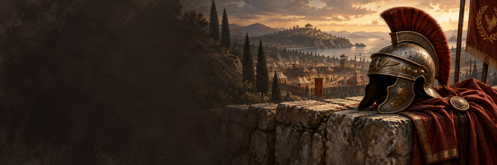

<p align="center">
  
</p>
<h1 align="center">Syncrash</h1>
<p align="center"><strong>Un parche para reducir los cierres de Imperivm.</strong></p>
<p align="center">
  <a href="https://github.com/AlvaroPeyleth/Imperivm-Syncrash/releases/latest">Descargar Syncrash</a> ·
  <a href="docs/TRANSPARENCIA.md">Qué modifica</a> ·
  <a href="docs/SEGURIDAD.md">Código y transparencia</a> ·
  <a href="docs/ENTREGA_ACTUAL.md">Verificar la descarga</a> ·
  <a href="docs/CREDITOS.md">Créditos</a>
</p>



Syncrash es un parche independiente para **Imperivm RTC: HD Edition — Great Battles of Rome**, pensado para la edición de Steam sin mods (**Steam vanilla**). El proyecto investiga los cierres y las desincronizaciones del juego.

**Es experimental.** Protege frente a tres casos de cierre identificados, pero no evita todos los fallos ni corrige todavía las desincronizaciones. Si lo pruebas, cuéntanos cómo te va.

La [versión actual, v1.0.6](docs/ENTREGA_ACTUAL.md), amplía la memoria disponible y añade pantalla adaptable con suavizado y reparación de voces en español, italiano e inglés. Pantalla y voces vienen **marcadas por defecto**; puedes quitar cualquiera de las dos. Solo necesitas **Syncrash.exe** para aplicar el parche. Después abres el juego como siempre, también desde `gbr.exe`.

**El código, las recetas del parche y las instrucciones de compilación son públicos.** Puedes revisarlos y generar tu propia versión: [código y transparencia](docs/SEGURIDAD.md).

## Descargar y jugar

Descarga **[Syncrash.exe desde la última versión](https://github.com/AlvaroPeyleth/Imperivm-Syncrash/releases/latest)**. No necesitas PowerShell ni instalar nada más.

1. Cierra Imperivm y abre **Syncrash.exe**.
2. Si no encuentra el juego, pulsa **Elegir…** y selecciona el `gbr.exe` de tu edición de Steam sin mods.
3. Elige las opciones: **Añadir pantalla adaptable** y **Reparar voces de unidades** están marcadas por defecto. Puedes desmarcarlas; memoria y protección de cierres se incluyen siempre.
4. Pulsa **Aplicar parche**. Al terminar, abre Imperivm (versión Steam) y juega.

«Versión Steam» identifica la edición compatible del juego. Puedes abrirla directamente desde `gbr.exe` o tu acceso directo habitual; Syncrash no exige iniciarla desde el cliente de Steam. Otras ediciones, como la de disco, no tienen compatibilidad validada.

Puedes aplicarlo al juego original o actualizar un parche anterior reconocido. Si ya tienes el mismo parche, conserva `gbr.exe` sin reescribirlo. Para multijugador, utiliza la misma versión del parche y los mismos recursos en ambos equipos.

**Si cambias de idioma:** cierra el juego y vuelve a aplicar Syncrash antes de jugar para actualizar las voces.

**Para quitarlo:** desmarca **Añadir pantalla adaptable** y **Reparar voces de unidades**, aplica y después verifica archivos en Steam para recuperar también `gbr.exe`. Puedes retirar solo una función desmarcando su casilla. Steam no elimina por sí solo los WAV añadidos. Syncrash no crea copia de `gbr.exe`.

## ¿Puedo jugar con alguien que no tiene Syncrash?

En las pruebas entre jugadores con y sin Syncrash no se comunicaron problemas. Aún faltan más partidas para comprobar esa compatibilidad. La protección se aplica únicamente al equipo donde está instalado: no evita los cierres de otros jugadores ni garantiza que la partida continúe si alguien se desconecta. Que otro jugador no lo tenga no desactiva tu protección.

Recomendamos que todos utilicen la misma versión de Syncrash. Las pruebas mixtas corresponden a ensayos privados anteriores de la protección de cierres; la sesión comunicada con pantalla adaptable corresponde a 1.0.4. La comprobación multijugador con las nuevas voces sigue pendiente.

## Compatibilidad y alcance

| Edición o función | Estado |
| --- | --- |
| Steam vanilla | Disponible para los archivos exactos [identificados por SHA256](docs/TRANSPARENCIA.md#archivos-admitidos). |
| Protección de cierres | Comprueba el tipo de objeto antes de tres llamadas concretas. No cubre todos los posibles cierres. |
| Memoria | LAA amplía el espacio de direcciones disponible para el juego x86 en Windows de 64 bits. |
| Pantalla adaptable | Opcional, con suavizado GPU y márgenes negros; conserva el escritorio. |
| Voces de unidades | Opcional, en español, italiano e inglés, desde los PAK del jugador sin modificarlos. Falta escuchar todas las voces en partida. |
| Desincronizaciones | En investigación; v1 no incorpora una corrección de desync. |
| Conexión online automática | [Propuesta y pruebas planificadas](docs/CONEXION_ONLINE.md) para una futura casilla opcional. No incluida en v1.0.6. |
| Community Mod | Próximamente. La opción está desactivada. |
| Otros mods | Sin compatibilidad validada. |

Cuando haya soporte para Community, tendrás que **instalar primero el mod por sus canales habituales** y aplicar Syncrash después. [Hoja de ruta](docs/ROADMAP.md).

## Qué cambia en tu equipo

- Comprueba `gbr.exe` y `Packs/data.pak` antes de actuar; rechaza versiones desconocidas.
- Sustituye `gbr.exe`. Si eliges pantalla adaptable, instala también sus componentes y registro junto al juego. Si marcas voces, extrae archivos WAV y guarda una lista para poder retirarlos después. No modifica mapas, guardados ni PAK.
- No instala servicios, observadores ni actualizadores. No envía datos ni registros.
- Abrir la interfaz no modifica el juego. Los archivos solo cambian cuando aplicas las opciones o exportas las fuentes. Las órdenes CLI están descritas en la [ficha técnica](docs/CANDIDATO_1.0.6.md).

El aplicador contiene las diferencias necesarias, **no el ejecutable completo del juego**. Necesitas tu propia instalación de Steam.

## Pruebas de estabilidad

v1.0.6 pasó pruebas automáticas y de instalación sobre copias reales del juego; también se compararon dos compilaciones. El prototipo de voces en español recibió comentarios favorables. **Falta escuchar todas las voces en italiano e inglés y probar el multijugador con voces.** Las partidas registradas con 1.0.4 corresponden a aquella versión. [Evidencia y alcance](docs/CANDIDATO_1.0.6.md).

## Ayuda a mejorar Syncrash

Cuéntanos qué versión e idioma usaste, las opciones activadas, el mapa y cuánto duró la partida. ¿Sonaron bien las voces? ¿Hubo cierres, desyncs o algo extraño? **Si todo fue bien, también nos sirve saberlo.** No necesitas instalar un observador para participar.

Ante un fallo, conserva los **Logs de ambos jugadores antes de volver a abrir el juego**. Puedes enviarlos mediante el **[formulario de recopilación de logs](https://forms.gle/QAGziVvHk6peHPor9)** o por mensaje privado a **`xtalvarotx` en Discord**. Si no tienes Discord, utiliza el formulario. Los registros pueden contener IP y datos personales: no los publiques en incidencias de GitHub ni en canales públicos. [Guía de pruebas sencilla](docs/PRUEBAS_SIN_OBSERVADOR.md).

¿Buscas comunidad? Únete a **[Imperivm III Editores en Discord](https://discord.gg/YmWHktysx)**, un punto de encuentro para jugadores y modders, donde encontrarás Community Mod y otros proyectos de Imperivm.

Puedes abrir una [incidencia](https://github.com/AlvaroPeyleth/Imperivm-Syncrash/issues) con una descripción sin datos privados. Consulta [cómo colaborar](CONTRIBUTING.md).

## Otros proyectos de la comunidad

Descubre otros proyectos para ampliar o mejorar Imperivm en el [directorio de mods y herramientas de la comunidad](docs/PROYECTOS_COMUNIDAD.md).

## Autoría y reutilización

**Creado por [AlvaroPeyleth](https://github.com/AlvaroPeyleth) · Discord: `xtalvarotx`.**

El código propio se publica bajo [licencia MIT](LICENSE). Puedes usarlo, modificarlo e integrarlo en tu mod, conservando el aviso de copyright y la licencia. Si lo incorporas a tu proyecto, agradecemos esta mención visible:

> Incluye trabajo de Syncrash, de AlvaroPeyleth (Discord: xtalvarotx).
> https://github.com/AlvaroPeyleth/Imperivm-Syncrash

La mención visible es una petición de reconocimiento; las obligaciones legales son las de MIT. Los derechos sobre Imperivm y los proyectos de terceros pertenecen a sus titulares. Syncrash no está afiliado al desarrollador ni al editor del juego.

## Gracias por hacerlo posible

Gracias a **Feronidas, Rubeneitor, Wini, Upercat y Osuka9 / Osquita** por compartir registros que ayudan a investigar los fallos. Gracias también a mi hermano y a quienes dedican tiempo a probar y comunicar lo que ocurre.

En los [créditos](docs/CREDITOS.md) puedes ver quién ha aportado registros, pruebas y referencias técnicas.

## Compilar y conocer el proyecto

Los mensajes del código fuente se [revisaron el 04/10/2026](CHANGELOG.md#revisión-de-textos--4-de-octubre-de-2026). Si compilas esta revisión, verás esos textos nuevos; la descarga v1.0.6 conserva los de su publicación.

El código propio usa MIT. Los componentes de pantalla tienen sus propias licencias; puedes exportar sus fuentes desde el aplicador. Consulta los detalles y las pruebas en la [ficha de 1.0.6](docs/CANDIDATO_1.0.6.md).

En Windows, con **PowerShell 7.6.5 (`pwsh`)**, .NET SDK `8.0.400` y referencias de .NET Framework 4.8:

```powershell
& ./src/Syncrash/build.ps1 -OutputPath ./work/mi-candidato/Syncrash.exe
& ./tests/run.ps1 -OutputDirectory ./work/mi-prueba
& ./scripts/compare-builds.ps1 -OutputDirectory ./work/mi-comparacion
```

Los comandos anteriores generan la base de desarrollo con voces y sin pantalla. Para el EXE completo, añade `-ScreenBundleDirectory <bundle revisado>` a cada comando: el build valida por hash componentes, perfiles y fuentes antes de incrustarlos. No descarga dependencias ni sobrescribe un EXE existente. [Compilación, hashes y recuperación](docs/CANDIDATO_1.0.6.md).

[Funcionamiento](docs/FUNCIONAMIENTO.md) · [Transparencia](docs/TRANSPARENCIA.md) · [Cambios](CHANGELOG.md) · [Hoja de ruta](docs/ROADMAP.md) · [Plan de pruebas](docs/PLAN_DE_EJECUCION.md)
