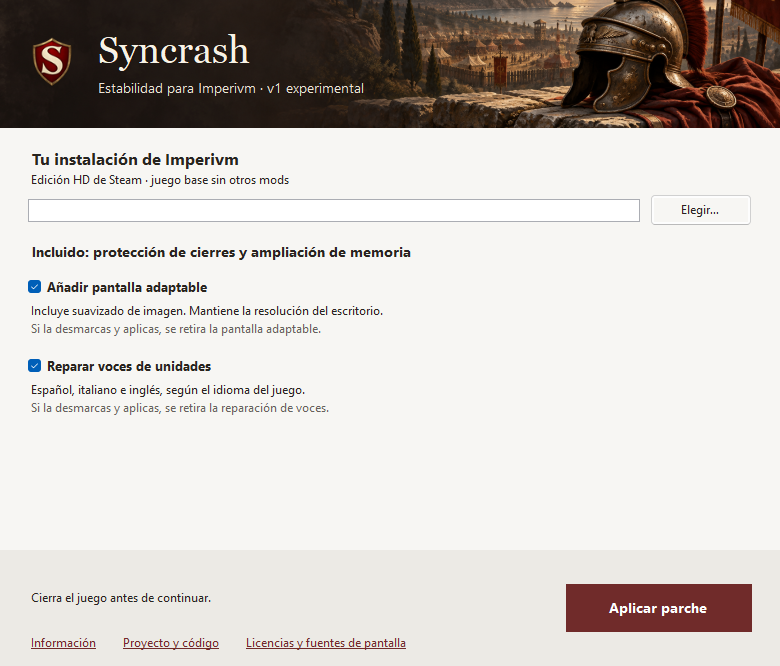

# Syncrash v1.0.6 · Casillas unificadas

**28/09/2026 · Publicada como v1.0.6 experimental.** Syncrash v1 sigue siendo experimental y esperamos feedback. El cambio online permanece como propuesta sin implementar.

## Archivo y cambios

| Dato | Valor |
| --- | --- |
| Aplicador | `Syncrash.exe` · 1.0.6.0 · 1.0.6 |
| Tamaño | 18.579.968 bytes |
| SHA256 | `c3be15d959263a69e32b4abd0623b9cc29e5d162695e4c65fa51977965d8eeb2` |
| Resultado `gbr.exe` | `af59a5bbb4956f50dd671a4a52753376b7b359b2028c0331a2db5fde6f64c965` |

- Pantalla y voces son opciones independientes, marcadas por defecto: **marcar y aplicar instala; desmarcar y aplicar retira**. Memoria y protección de cierres permanecen. Se elimina el botón separado de restauración de pantalla.
- Ayudas de retirada en gris; información, proyecto y fuentes al pie fijo. Ventana pequeña con desplazamiento central.
- «Versión Steam» identifica la edición compatible. Puedes abrir directamente `gbr.exe`, sin mantener Syncrash abierto.
- Versión alineada en ensamblado, archivo, título y manifiesto de Windows. Documentación pública sin denominaciones de prototipos privados.

## Uso, recuperación y compilación

Cierra el juego, selecciona `gbr.exe`, elige las casillas y aplica. Para retirar pantalla o voces, desmarca su casilla y aplica. Para cambiar una variante de pantalla anterior, retírala primero así y después marca/aplica la nueva. Se conservan archivos ajenos o modificados y se muestra un error si impiden completar la operación. Para recuperar además el ejecutable original, verifica los archivos del juego con Steam; no se crea copia de `gbr.exe`.

Voces conserva español, italiano e inglés de v1.0.5. Si cambias el idioma, cierra y reaplica para sustituir los WAV registrados. Las fuentes/licencias de pantalla se exportan desde el pie del aplicador. [Funcionamiento de las casillas](FUNCIONAMIENTO.md#casillas-unificadas).

CLI: `--apply` aplica memoria/cierres y conserva pantalla; `--apply-with-voices` añade voces sin retirar pantalla; `--apply-all` añade pantalla con suavizado y voces; `--remove-screen` y `--remove-voices` retiran cada función. `--check`, `--check-screen` y `--check-voices` comprueban sin aplicar. `--export-screen-sources <nuevo.zip>` exporta sin sobrescribir archivos existentes.

Compilación completa con PowerShell 7.6.5, Roslyn de .NET SDK 8.0.400, referencias .NET Framework 4.8 y bundle nativo revisado. [Comandos del README](../README.md#compilar-y-conocer-el-proyecto). Se conservan los componentes nativos y el mapa de voces de v1.0.5.

## Comprobaciones y límites

El EXE identificado arriba superó **38 pruebas automáticas**, dos builds completos idénticos y **siete aplicaciones desde el manejador real de la interfaz en copia aislada**. Se cubren las cuatro combinaciones de pantalla/voces, repetición de retirada y reinstalación; verificados componentes de pantalla, 188 WAV españoles o su retirada, manifiestos y conservación de hashes de EXE ya parcheado, PAK e INI. Las pruebas automáticas cubren reconstrucción, errores, archivos ajenos/modificados, concurrencia, CLI, voces en tres idiomas y recuperación de interrupciones.

Interfaz renderizada a 780×666 y 710×520. Estas comprobaciones no equivalen a partidas, validación de todos los DPI o lectores de pantalla. Los candidatos locales y ensayos históricos conservan sus propios hashes y alcance. El EXE se reprodujo desde el commit limpio `c73edca69b05559a42234138f7b7d5ab12e50963`, con [CI correcto](https://github.com/AlvaroPeyleth/Imperivm-Syncrash/actions/runs/36354762010). Se publicaron EXE, sumas y licencia; los tres archivos descargados coinciden con las copias verificadas. CI prueba la base sin bundle nativo; el EXE completo se comprobó localmente. [Ficha de entrega](ENTREGA_ACTUAL.md).

No se modifica la simulación, el resultado del parche base ni el contenido de voces/pantalla. No se han repetido partidas; multijugador con voces y escucha completa italiana/inglesa siguen pendientes. No se añade corrección causal de desync, Community Mod ni conectividad automática. Base, pantalla y voces no forman una transacción atómica: ante interrupciones, conservar los registros y reaplicar con el juego cerrado.

[Entrega e historial](ENTREGA_ACTUAL.md) · [Fuentes](SEGURIDAD.md) · [Ficha histórica de voces](CANDIDATO_1.0.5.md)
