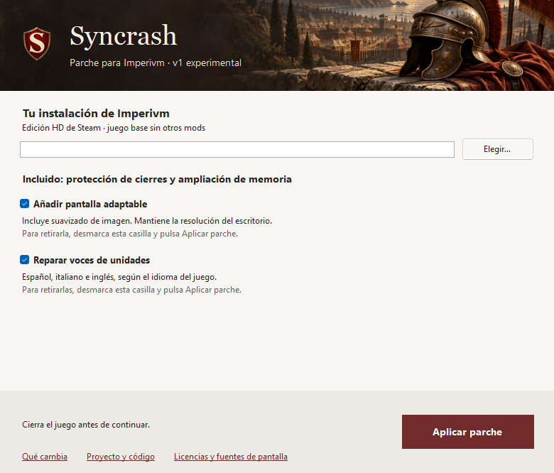

# Syncrash v1.0.7 · Textos más claros

**04/10/2026 · Publicada como v1.0.7 experimental.** Esta versión lleva al aplicador la revisión de textos del repositorio. Sigue siendo experimental; conserva las funciones de v1.0.6 y sus pruebas pendientes en partida.

## Archivo y cambios

| Dato | Valor |
| --- | --- |
| Aplicador | `Syncrash.exe` · 1.0.7.0 · 1.0.7 |
| Tamaño | 18.579.968 bytes |
| SHA256 | `af1d7d01b82d7488fef2eec44355d82b4a9fbc4bfd7b2ef21c160d874205c1a4` |
| Resultado `gbr.exe` | `af59a5bbb4956f50dd671a4a52753376b7b359b2028c0331a2db5fde6f64c965` |

Mensajes y ayudas más directos, enlace «Qué cambia» y comentarios del código más claros. La documentación explica el uso con menos repeticiones. No cambia la lógica de instalación o retirada, las recetas del parche, el mapa de voces ni los componentes nativos. La versión está actualizada en el ensamblado, archivo, título y manifiesto de Windows.

## Uso y compilación

Cierra Imperivm, selecciona `gbr.exe`, elige las casillas y pulsa **Aplicar parche**. Marcar instala; desmarcar y aplicar retira pantalla o voces. Memoria y protección de cierres se mantienen. Para recuperar también el ejecutable original, retira las opciones y verifica los archivos en Steam. No se crea copia de `gbr.exe`.

Si cambias el idioma del juego, ciérralo y vuelve a aplicar Syncrash antes de jugar. Se conservan español, italiano e inglés. Las órdenes CLI funcionan como en [v1.0.6](CANDIDATO_1.0.6.md#uso-recuperación-y-compilación).

Se compila con PowerShell 7.6.5, Roslyn de .NET SDK 8.0.400, referencias de .NET Framework 4.8 y el bundle nativo revisado. Los [comandos del README](../README.md#compilar-y-conocer-el-proyecto) incluyen pruebas y comparación de compilaciones. El EXE completo requiere `-ScreenBundleDirectory <bundle revisado>`.

## Pruebas del 04/10/2026

- **38 pruebas automáticas superadas con el EXE completo**, incluidas instalación, retirada, recuperación de interrupciones, archivos ajenos o modificados, concurrencia, CLI y voces en tres idiomas.
- **Dos compilaciones completas idénticas byte a byte**, con el mismo SHA256 que el EXE probado.
- Interfaz dibujada y revisada a 780×666 y 710×520, con pantalla y voces disponibles. Los enlaces y el botón permanecen al pie; el contenido central se desplaza en la ventana pequeña.
- Documentación y enlaces locales revisados antes de publicar. Los resultados históricos mantienen sus fechas, versiones y hashes.

El preparador reprodujo el EXE desde el commit limpio `512e3cfba3c109a4d22042bb652f8fc9269079ba`. [GitHub Actions](https://github.com/AlvaroPeyleth/Imperivm-Syncrash/actions/runs/37222726535) pasó las pruebas y la comparación de la base sin componentes nativos; el EXE completo se comprobó localmente. Se publicó [v1.0.7](https://github.com/AlvaroPeyleth/Imperivm-Syncrash/releases/tag/v1.0.7) y se descargaron EXE, sumas y licencia: los tres coinciden byte a byte con los archivos preparados. [Ficha de entrega](ENTREGA_ACTUAL.md).

Estas pruebas no incluyen nuevas partidas, otros DPI ni lectores de pantalla. La escucha completa en italiano e inglés y el multijugador con voces siguen pendientes. No se añade una corrección de desincronizaciones, soporte Community Mod ni conexión online automática. Ante una operación interrumpida, conserva los registros y vuelve a aplicar con el juego cerrado.

[Funcionamiento](FUNCIONAMIENTO.md) · [Código y fuentes](SEGURIDAD.md) · [Historial de v1.0.6](CANDIDATO_1.0.6.md)
